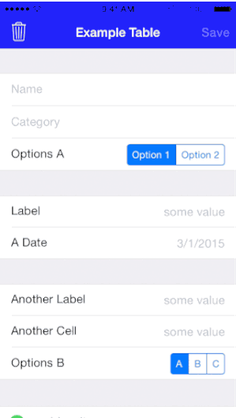

# DataEntryToolbar

DataEntryToolbar is a subclass of UIToolbar intended for use as the input accessory view of a keyboard or picker, providing Next, Previous, & Done buttons to navigate up and down a dynamic tableView.

## Example Setup

1. Create an instance of `DataEntryToolbar` in your `TableViewController` subclass:

    private lazy var dataEntryToolbar: DataEntryToolbar? = {
        if let dataEntryToolbar = DataEntryToolbar(frame: CGRectMake(0, 0, UIScreen.mainScreen().bounds.width, 44), table:self.tableView) as DataEntryToolbar? {
            
            dataEntryToolbar.toolbarDelegate = self
            return dataEntryToolbar
        } else {
            return nil
        }
    }()

2. In `cellForRowAtIndexPath`, set a `DataEntryToolbar` instance as the `inputAccessoryView` for your cell's text field. Also, add that text field to the `tableTextFields` dictionary using the current indexPath as key:

    override func tableView(tableView: UITableView, cellForRowAtIndexPath indexPath: NSIndexPath) -> UITableViewCell {

        switch (indexPath.section) {

        // first section -- basic info
        case TableSections.BasicInfo.rawValue:
            switch (indexPath.row) {
            case 0:
                let nameCell = tableView.dequeueReusableCellWithIdentifier("NameCell", forIndexPath: indexPath) as JDCustomTextFieldCell
                nameCell.textField.inputAccessoryView = self.dataEntryToolbar
                self.dataEntryToolbar?.tableTextFields[indexPath] = nameCell.textField
                nameCell.textField.text = self.textFieldData[indexPath]
                return nameCell
            }
            `...`
        }
        `...`
    }

3. To be notified as a user navigates through the table, implement only the methods you need from `DataEntryToolbarDelegate` (will soon be replaced with closures). The methods with a `lastUpdatedTextField` parameter pass in the text field that was navigated away from, in case you need to save it's contents:

    func previousButtonTapped(lastActiveTextField: UITextField?) {
        if let textField = lastActiveTextField {
            self.textFieldShouldReturn(textField)
        }
    }

    func nextButtonTapped(lastActiveTextField: UITextField?) {
        if let textField = lastActiveTextField {
            self.textFieldShouldReturn(textField)
        }
    }

    func doneButtonTapped(lastActiveTextField: UITextField?) {
        if let textField: UITextField! = lastActiveTextField {
            self.textFieldShouldReturn(textField)
        }
    }

4. You can customize the appearance of the toolbar in several ways. The height can be specified in the initializer, or you can change the color of the toolbar itself or its buttons:

    // adjust bar's tint color
    self.dataEntryToolbar.barTintColor = UIColor.darkGrayColor()

    // adjust prev/next button tint colors
    self.dataEntryToolbar.previousButton.tintColor = UIColor.blueColor()

## Note

If using a subclass of `UITableViewController`, the active text field will always be automatically scrolled into a position above the keyboard so the user can see it. If you are using a `UITableView` inside a regular `UIViewController`, you will have to implement this functionality yourself.

Suggestions or improvements always welcome!

## Usage

To run the example project, clone the repo, and run `pod install` from the Example directory first.

## Installation

DataEntryToolbar is available through [CocoaPods](http://cocoapods.org). To install
it, simply add the following line to your Podfile:

    pod "DataEntryToolbar"

## Author

jeff, jday@jdayapps.com

## License

DataEntryToolbar is available under the MIT license. See the LICENSE file for more info.